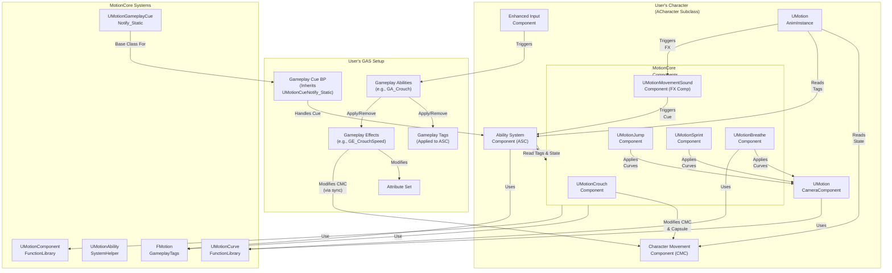

# Motion 2.0 Architecture

This document describes the architecture of the Motion 2.0.

## Overview

Motion 2.0 provides a flexible and extensible foundation for character movement and abilities within Unreal Engine. It follows a **decoupled component-based design**, leveraging the standard **Gameplay Ability System (GAS)** and **Enhanced Input** system. Components are intended to be added to a user's existing `ACharacter` or custom character class.

The architecture focuses on providing specialized `UMotionComponent` subclasses that **react to GAS states (Gameplay Tags)** and handle specific features (like crouching, sprinting, sounds, camera effects).&#x20;

The responsibility for **input binding, ability activation, and state management via GAS** lies with the end-user's project setup.

## Key Components and Systems

* **Core (`Source/MotionCore/Core`)**:
  * `UMotionComponent`: Base class for MotionCore components, providing common initialization logic.
  * `MotionEnums.h`: Defines various enums used throughout the plugin (e.g., `EMovementDirection`).
  * `MotionStructs.h`: Contains core data structures used by the plugin (e.g., `FStructMotionCurve`, `FSurfaceEffectAssets`, `FWeightBasedSoundVariations`, `FMotionMovementEffectContext`).
* **Character & Movement (User Provided)**:
  * **User's Character (`ACharacter` subclass)**: Users integrate MotionCore by adding its components to their own character class. The plugin **no longer provides `AMotionCharacter`**.
  * **Standard `UCharacterMovementComponent`**:
    Users rely on the standard engine component.

<ImportantAlert>
  <AlertDescription>
    The plugin **no longer provides `UMotionCharacterMovementComponent`**.
  </AlertDescription>
</ImportantAlert>

* **Speed Management**: Modifications to movement speed (e.g., for crouching, sprinting, buffs) are expected to be handled via **user-created Gameplay Effects** targeting a **user-defined speed Attribute** (e.g., `MaxWalkSpeed` in their `AttributeSet`). These effects should use appropriate modifiers (Add, Multiply, Override). The final calculated attribute value must then be **synced** to the standard `UCharacterMovementComponent`'s `MaxWalkSpeed` property by the user (e.g., via the provided `UMotionSpeedSyncComponent`).
* **Gameplay Ability System (`Source/MotionCore/AbilitySystem` & User Provided)**:
  * `FMotionGameplayTags`: Manages native Gameplay Tags used by the plugin primarily for **character states** (e.g., `State.Movement.Crouching`, `State.Movement.Sprinting`). Input-related tags are now handled by the user's Enhanced Input setup. Also includes tags for Movement FX context (Type, Foot, Weight, Profile, Environment, Cue).
* `UMotionAbilitySystemHelper`: Provides limited static utility functions for GAS (e.g., getting the ASC).&#x20;

<Alert>
  <AlertDescription>
    **Does not handle input binding**.
  </AlertDescription>
</Alert>

* `UMotionGameplayCueNotify_Static`: C++ base class for the generic movement FX Gameplay Cue. Contains core logic for parsing context, looking up assets, and spawning effects. Users can inherit from this in Blueprint for further customization.
* **User's GAS Setup**: The plugin **requires** the user's project to have GAS configured (Ability System Component, Attribute Sets).
* **User's Gameplay Abilities/Effects**: Users must create Gameplay Abilities (e.g., `GA_Character_Crouch`, `GA_Character_Sprint`) triggered by input. These abilities apply/remove the relevant **Gameplay Tags** (e.g., `State.Movement.Crouching`) and apply/remove **Gameplay Effects** (e.g., `GE_Movement_CrouchSpeed`, `GE_Movement_SprintSpeed`) that modify the user's speed attribute. For gradual effects (like sprint ramp-up/down), the GA typically applies an Infinite GE with `Set By Caller` magnitude and uses a Timer to periodically update the magnitude based on curves and elapsed time (potentially queried from components like `UMotionSprintComponent`).
* **Component Reaction**: Motion Components (`UMotionCrouchComponent`, `UMotionJumpComponent`, `UMotionSprintComponent`) primarily **react** to the presence or absence of specific Gameplay Tags on the character's ASC to perform their logic (e.g., capsule resize, applying camera curves). `UMotionSprintComponent` now also manages ramp-down state.

<Alert>
  <AlertDescription>
    They **do not manage state internally** or handle input.
  </AlertDescription>
</Alert>

* **Components (`Source/MotionCore/Components`)**: These attach to the user's Character and implement specific features:
  * `UMotionBreatheComponent`: Manages procedural breathing effects by reading velocity from the standard `UCharacterMovementComponent` and adding/pausing a rotation curve directly on the `UMotionCameraComponent` when velocity is below a threshold.
  * `UMotionCrouchComponent`: Reacts to the `State.Movement.Crouching` tag to perform capsule resizing (`PerformCapsuleResize`) and provides checks (`CanUncrouch`).&#x20;

<Alert>
  <AlertDescription>
    **Does not handle speed changes** (expects user's GAS Ability/Effect).
  </AlertDescription>
</Alert>

* **`UMotionJumpComponent`**: Reacts to the `State.Movement.Jumping` tag. Applies camera curves via `UMotionCameraComponent` upon jumping and landing.&#x20;

<Alert>
  <AlertDescription>
    **Does not handle speed/jump height changes** (expects user's GAS Ability/Effect).
  </AlertDescription>
</Alert>

* **`UMotionMovementSoundComponent`** (Conceptually: **Motion Movement FX Component**):&#x20;
  Detects movement events (footsteps via Anim Notify `TriggerFootstepEffect`, landing via `OnMovementModeChanged` calling `HandleSpecificMovementEffect`).&#x20;
* Determines context (surface via trace, character state/speed/weight via ASC, environmental context via overlap checks). Includes optional throttling for footsteps and landings. Triggers a **generic Gameplay Cue** (e.g., `Motion.GameplayCue.Movement.FootstepFX`) locally on the owning client, passing rich context via a custom `FMotionMovementEffectContext` and `AggregatedSourceTags`. Requires a `SurfaceEffectsTable` DataTable (using `FSurfaceEffectAssets` rows) for defining effects per surface.&#x20;
* The triggered Gameplay Cue (ideally inheriting from `UMotionGameplayCueNotify_Static`) handles the actual effect spawning.
* **`UMotionSprintComponent`**: Reacts to the `State.Movement.Sprinting` tag. Applies a camera curve via `UMotionCameraComponent` while sprinting. &#x20;
* Tracks sprint duration (`GetCurrentSprintDuration`) and manages ramp-down state (`StartRampDown`, `StopRampDown`, `GetRampDownElapsedTime`, etc.) for use by the Gameplay Ability.

<Alert>
  <AlertDescription>
    **Does not handle speed changes** (expects user's GAS Ability/Effect).
  </AlertDescription>
</Alert>

* **Animation (`Source/MotionCore/Animation`)**:
  * `UMotionAnimInstance`: Custom Animation Instance class. Reads state information likely from the Character's standard `UCharacterMovementComponent` and the **ASC Gameplay Tags** (e.g., `State.Movement.Sprinting`, `State.Movement.Crouching`) to drive animations.

<Alert>
  <AlertDescription>
    **No longer depends on a custom `UMotionAbilitySystemComponent`**.
  </AlertDescription>
</Alert>

* **Camera (`Source/MotionCore/Camera`)**:
  * **`UMotionCameraComponent`**: A custom camera component (intended to be attached to the user's Character or SpringArm).&#x20;
  * Manages the camera view and allows applying procedural effects through **internally managed** location and rotation curves (`FStructMotionCurve`). Components like `UMotionBreatheComponent` interact directly with this component's functions to add/remove/pause curves.

<Alert>
  <AlertDescription>
    **No longer depends on `UMotionCurveManager`**.&#x20;
  </AlertDescription>
</Alert>

* **Function Libraries (`Source/MotionCore/FunctionLibraries`)**:
  * `UMotionComponentFunctionLibrary`: Provides general utility functions for components (e.g., `GetIdentifier`).
  * `UMotionCurveFunctionLibrary`: Offers static functions for evaluating runtime curves (`FRuntimeVectorCurve`, `FRuntimeFloatCurve`), used by `UMotionCameraComponent`.
* **Input (User Provided)**:
  * **Enhanced Input**: Users are expected to use Unreal's Enhanced Input system.
  * **Input Actions & Mapping Contexts**: Users define their own `UInputAction` assets and `UInputMappingContext`.
  * **Binding**: Input binding occurs in the user's Character or PlayerController using `UEnhancedInputComponent`, typically triggering Gameplay Abilities on the ASC. **The plugin provides no input components or configuration assets.**

## Architecture Diagram (Mermaid)

## Data Flow & Interactions

* **Input**: Player input is processed by the **user's Enhanced Input setup**. Input Actions trigger **user-defined Gameplay Abilities** on the character's Ability System Component (ASC).
* **Abilities & State**: User-defined Gameplay Abilities run on the ASC.&#x20;
* They apply/remove **Gameplay Tags** (like `State.Movement.Crouching`) to the ASC and apply/remove **Gameplay Effects** (like `GE_Movement_CrouchSpeed`) which modify **user-defined attributes** (like `MaxWalkSpeed`).&#x20;
* For gradual effects, they manage timers and update Set By Caller magnitudes on active GEs, potentially querying state (like ramp-down status) from components like `UMotionSprintComponent`.
* **Component Reaction**: MotionCore Components (`UMotionCrouchComponent`, `UMotionSprintComponent`, etc.) have delegates bound to the ASC that **listen for changes** in relevant Gameplay Tags (e.g., `State.Movement.Crouching`).&#x20;
* When a tag is added/removed, the component reacts accordingly (e.g., `UMotionCrouchComponent` calls `PerformCapsuleResize`, `UMotionSprintComponent` pauses/unpauses its camera curve and updates its internal state).&#x20;

<Alert>
  <AlertDescription>
    They **do not manage the core ability state or speed** themselves, but may provide helper state/functions for the GA (like sprint ramp-down).
  </AlertDescription>
</Alert>

* **Movement**: The **standard `UCharacterMovementComponent`** handles character physics. Its `MaxWalkSpeed` property must be kept **synchronized** with the final value of the user's `MaxWalkSpeed` attribute (after all Gameplay Effect modifiers are applied) by a user-implemented mechanism (or the provided `UMotionSpeedSyncComponent)`.&#x20;
* **`UMotionCrouchComponent`** directly adjusts the capsule size based on its tag state.
* **Animation**: The `UMotionAnimInstance` reads state primarily from the **standard `UCharacterMovementComponent`** and **Gameplay Tags present on the ASC** to drive animations. **Animation Notifies** trigger functions on `UMotionMovementSoundComponent` (`TriggerFootstepEffect`).
* **Camera**: The `UMotionCameraComponent` calculates the final view. Components like `UMotionBreatheComponent`, `UMotionJumpComponent`, and `UMotionSprintComponent` dynamically add/remove/pause **location/rotation curves** directly on the `UMotionCameraComponent` via its functions based on character state or events.
* **Movement FX**: The `UMotionMovementSoundComponent` is triggered by **Animation Notifies** (`TriggerFootstepEffect`) or landing logic (`HandleSpecificMovementEffect`). It determines context (surface, state, speed, environment tags), applies throttling, and executes a generic **Gameplay Cue** locally via the ASC, passing context via parameters and a custom effect context containing a pointer to the relevant `FSurfaceEffectAssets` row data.&#x20;
* The **user-created Gameplay Cue Blueprint** (inheriting from `UMotionGameplayCueNotify_Static`) then reads this context, uses the provided row data, and spawns the appropriate sounds (with variations), visuals, and other effects.
