# Motion 2.0 Architecture

This document describes the architecture of the Motion 2.0.

## Overview

Motion 2.0 provides a flexible and extensible foundation for character movement and abilities within Unreal Engine. It follows a **decoupled component-based design**, leveraging the standard **Gameplay Ability System (GAS)** and **Enhanced Input** system. Components are intended to be added to your existing `ACharacter` or custom character class.

The architecture focuses on providing specialized `UActorComponent` subclasses (Motion Components) that **react to GAS states (Gameplay Tags)** and handle specific features (like crouching, sprinting, sounds, camera effects).&#x20;

The responsibility for **input binding, ability activation, and state management via GAS** lies with your project setup.

## Key Components and Systems

* **Core**:
  * `UMotionComponent`: (Removed) Previously the base class for MotionCore components. Components now derive directly from `UActorComponent` and manage their own common references (e.g., to `ACharacter`, `UAbilitySystemComponent`), typically obtained in `BeginPlay`. The robust initialization of the Ability System Component reference now uses a delegate if the ASC is not immediately available.
  * `MotionEnums.h`: Defines various enums used throughout the plugin (e.g., `EMovementDirection`).
  * `MotionStructs.h`: Contains core data structures used by the plugin (e.g., `FStructMotionCurve`, `FSurfaceEffectAssets`, `FWeightBasedSoundVariations`, `FMotionMovementEffectContext`).
* **Character & Movement (Provided by you)**:
  * **Your Character (`ACharacter` subclass)**: You integrate Motion Core by adding its components to your own character class. The plugin **no longer provides `AMotionCharacter`**.
  * **Standard `UCharacterMovementComponent`**: Relying on the standard engine component.

<ImportantAlert>
  <AlertDescription>
    The plugin **no longer provides `UMotionCharacterMovementComponent`**.
  </AlertDescription>
</ImportantAlert>

* **Speed Management**: Modifications to movement speed (e.g., for crouching, sprinting, buffs) are expected to be handled via **Gameplay Effects you create** targeting a **speed Attribute you define** (e.g., `MaxWalkSpeed` in your `AttributeSet`).&#x20;
* These effects should use appropriate modifiers (Add, Multiply, Override). The final calculated attribute value must then be **synced** to the standard `UCharacterMovementComponent`'s `MaxWalkSpeed` property by you (e.g., via the provided `UMotionSpeedSyncComponent`).
* **Gameplay Ability System (`Source/MotionCore/AbilitySystem` & Provided by you)**:
  * `FMotionGameplayTags`
    * Manages native Gameplay Tags used by the plugin primarily for **character states** (e.g., `State.Movement.Crouching`, `State.Movement.Sprinting`).&#x20;
    * Input-related tags are now handled by your Enhanced Input setup. Also includes tags for Movement FX context (Type, Foot, Weight, Profile, Environment, Cue).
* `UMotionAbilitySystemHelper`: Provides limited static utility functions for GAS (e.g., getting the ASC). Currently does not handle input binding or full ASC initialization orchestration (see `UMotionPawnExtensionComponent`).
* `UMotionGameplayCueNotify_Static`: C++ base class for the generic movement FX Gameplay Cue. Contains core logic for parsing context, looking up assets, and spawning effects. You can inherit from this in Blueprint for further customization.
* **Your GAS Setup**: The plugin **requires** your project to have GAS configured.
* **ASC Hosting & `IAbilitySystemInterface` (You provide)**:
  * **Recommended Host: `APlayerState`**: For networked games, it is **strongly recommended** to host the `AbilitySystemComponent` (ASC) and primary `AttributeSet`(s) on your `APlayerState` subclass, not directly on the `ACharacter`. This ensures ability state and attributes persist across pawn respawns.
  * **`IAbilitySystemInterface`**: The ASC host (e.g., your C++ `APlayerState` subclass) **must** implement `IAbilitySystemInterface` in C++ and override `GetAbilitySystemComponent()` to return its ASC. This is crucial for performance and compatibility with engine GAS utilities.
  * **ASC Replication Mode**: Consider setting the ASC's `ReplicationMode` to `EGameplayEffectReplicationMode::Mixed`. `Full` sends more data but might be needed if clients need all GE details on other players. `Minimal` is mainly for AI/non-player characters if only tags/activation are needed.
* **AttributeSets (You provide / `UMotionAttributeSet`):**
  * **Default Subobjects (DSO):** The preferred method for adding AttributeSets (like `UMotionAttributeSet` or custom ones) is to create them as Default Subobjects in the C++ constructor of their owning actor (ideally the `APlayerState`). This makes them available immediately on clients without waiting for replication.
    ```cpp
    // Example in a custom AMyPlayerState constructor
    // MyAttributeSet = CreateDefaultSubobject<UMyAttributeSet>(TEXT("MyAttributeSet"));
    ```
* **ASC Initialization (`InitAbilityActorInfo` & `UMotionPawnExtensionComponent`):**
  * The engine function `UAbilitySystemComponent::InitAbilityActorInfo(OwnerActor, AvatarActor)` **must** be called on the ASC for both server and client.
    * For a `PlayerState`-hosted ASC, `OwnerActor` is the `PlayerState`, and `AvatarActor` is the `ACharacter`.
    * This is typically done in the Character's `PossessedBy` (server) and `OnRep_PlayerState` (client) after obtaining the ASC from the `PlayerState`.
  * **`UMotionPawnExtensionComponent` (`Source/MotionCore/Pawn`)**: This component **must be added** to your `ACharacter`. It acts as a centralized coordinator for ASC readiness.
    * After the Character successfully calls `InitAbilityActorInfo` on its ASC, it **must** then call `MotionPawnExtensionComponent->InitializeAbilitySystem(ASC, ASCOwner)` (where `ASCOwner` is usually the `PlayerState`).
    * Other Motion Core components (e.g., `UMotionCrouchComponent`) then register with the `MotionPawnExtensionComponent` (via `OnAbilitySystemInitialized_RegisterAndCall`) to be notified when the ASC is ready, rather than trying to find it themselves.
* **Your Gameplay Abilities/Effects**: You must create Gameplay Abilities (e.g., `GA_Character_Crouch`, `GA_Character_Sprint`) triggered by input. These abilities apply/remove the relevant **Gameplay Tags** (e.g., `State.Movement.Crouching`) and apply/remove **Gameplay Effects** (e.g., `GE_Movement_CrouchSpeed`, `GE_Movement_SprintSpeed`) that modify your speed attribute.
* **Component Reaction**: Motion Components (now `UActorComponent` subclasses like `UMotionCrouchComponent`, `UMotionJumpComponent`, `UMotionSprintComponent`) primarily **react** to the presence or absence of specific Gameplay Tags on the character's ASC to perform their logic (e.g., capsule resize, applying camera curves). `UMotionSprintComponent` now also manages ramp-down state.

<Alert>
  <AlertDescription>
    They **do not manage state internally** or handle input.
  </AlertDescription>
</Alert>

* **Components (`Source/MotionCore/Components`)**: These attach to your Character and implement specific features:
  * `UMotionBreatheComponent`: Manages procedural breathing effects by reading velocity from the standard `UCharacterMovementComponent` and adding/pausing a rotation curve directly on the `UMotionCameraComponent` when velocity is below a threshold.
  * `UMotionCrouchComponent`: Reacts to the `State.Movement.Crouching` tag to perform capsule resizing (`PerformCapsuleResize`) and provides checks (`CanUncrouch`).&#x20;

<Alert>
  <AlertDescription>
    **Does not handle speed changes** (expects your GAS Ability/Effect).
  </AlertDescription>
</Alert>

* **`UMotionJumpComponent`**: Reacts to the `State.Movement.Jumping` tag. Applies camera curves via `UMotionCameraComponent` upon jumping and landing.&#x20;

<Alert>
  <AlertDescription>
    **Does not handle speed/jump height changes** (expects your GAS Ability/Effect).
  </AlertDescription>
</Alert>

* **`UMotionMovementSoundComponent`** (Conceptually: **Motion Movement FX Component**):&#x20;
  Detects movement events (footsteps via Anim Notify `TriggerFootstepEffect`, landing via `OnMovementModeChanged` calling `HandleSpecificMovementEffect`).&#x20;
* Determines context (surface via trace, character state/speed/weight via ASC, environmental context via overlap checks). Includes optional throttling for footsteps and landings. Triggers a **generic Gameplay Cue** (e.g., `Motion.GameplayCue.Movement.FootstepFX`) locally on the owning client, passing rich context via a custom `FMotionMovementEffectContext` and `AggregatedSourceTags`. Requires a `SurfaceEffectsTable` DataTable (using `FSurfaceEffectAssets` rows) for defining effects per surface.&#x20;
* The triggered Gameplay Cue (ideally inheriting from `UMotionGameplayCueNotify_Static`) handles the actual effect spawning.
* **`UMotionSprintComponent`**: Reacts to the `State.Movement.Sprinting` tag. Applies a camera curve via `UMotionCameraComponent` while sprinting. &#x20;
* Tracks sprint duration (`GetCurrentSprintDuration`) and manages ramp-down state (`StartRampDown`, `StopRampDown`, `GetRampDownElapsedTime`, etc.) for use by the Gameplay Ability.

<Alert>
  <AlertDescription>
    **Does not handle speed changes** (expects your GAS Ability/Effect).
  </AlertDescription>
</Alert>

* **Animation (`Source/MotionCore/Animation`)**:
  * `UMotionAnimInstance`: Custom Animation Instance class. Reads state information likely from the Character's standard `UCharacterMovementComponent` and the **ASC Gameplay Tags** (e.g., `State.Movement.Sprinting`, `State.Movement.Crouching`) to drive animations.

<Alert>
  <AlertDescription>
    **No longer depends on a custom `UMotionAbilitySystemComponent`**.
  </AlertDescription>
</Alert>

* **Camera (`Source/MotionCore/Camera`)**:
  * **`UMotionCameraComponent`**: A custom camera component (intended to be attached to the user's Character or SpringArm).&#x20;
  * Manages the camera view and allows applying procedural effects through **internally managed** location and rotation curves (`FStructMotionCurve`). Components like `UMotionBreatheComponent` interact directly with this component's functions to add/remove/pause curves.

<Alert>
  <AlertDescription>
    **No longer depends on `UMotionCurveManager`**.&#x20;
  </AlertDescription>
</Alert>

* **Function Libraries (`Source/MotionCore/FunctionLibraries`)**:
  * `UMotionComponentFunctionLibrary`: Provides general utility functions for components (e.g., `GetIdentifier`).
  * `UMotionCurveFunctionLibrary`: Offers static functions for evaluating runtime curves (`FRuntimeVectorCurve`, `FRuntimeFloatCurve`), used by `UMotionCameraComponent`.
* **Input (You provide)**:
  * **Enhanced Input**: You are expected to use Unreal's Enhanced Input system.
  * **Input Actions & Mapping Contexts**: You define your own `UInputAction` assets and `UInputMappingContext`.
  * **Binding**: Input binding occurs in your Character or PlayerController using `UEnhancedInputComponent`, typically triggering Gameplay Abilities on the ASC. **The plugin provides no input components or configuration assets.**

## Architecture Diagram (Mermaid)

```mermaid
graph TD
    subgraph YourCharacter ["Your Character<br>(ACharacter Subclass)"]
        direction TB
        UserInput["Enhanced Input<br>Component"]
        UserASC["Ability System<br>Component (ASC)"]
        StdCMC["Character Movement<br>Component (CMC)"]
        UserAnimInst["UMotion<br>AnimInstance"]
        UserCamera["UMotion<br>CameraComponent"]
        UserPlayerController["Player Controller"]
        PlayerCamManager["Player Camera<br>Manager"]

        UserPlayerController -- "Owns" --> PlayerCamManager
        UserCamera -- "Gets & Uses" --> UserPlayerController
        UserCamera -- "Modifies & Reads<br>View Limits" --> PlayerCamManager

        subgraph MotionCoreComponents ["MotionCore<br>Components"]
            direction TB
            MC_Crouch["UMotionCrouch<br>Component"]
            MC_Jump["UMotionJump<br>Component"]
            MC_Sprint["UMotionSprint<br>Component"]
            MC_Breathe["UMotionBreathe<br>Component"]
            MC_FX["UMotionMovementSound<br>Component (FX Comp)"]
        end

        UserASC -- "Has Tags" --> MotionCoreComponents
        MotionCoreComponents -- "Read Tags & State" --> UserASC
        MC_Crouch -- "Modifies CMC<br>& Capsule" --> StdCMC
        MC_Jump -- "Applies<br>Curves" --> UserCamera
        MC_Sprint -- "Applies<br>Curves" --> UserCamera
        MC_Breathe -- "Applies<br>Curves" --> UserCamera
        MC_FX -- "Triggers<br>Cue" --> UserASC
        UserAnimInst -- "Reads<br>State" --> StdCMC
        UserAnimInst -- "Reads<br>Tags" --> UserASC
        UserAnimInst -- "Triggers<br>FX" --> MC_FX
    end

    subgraph YourGAS ["Your GAS Setup"]
        direction TB
        UserAbilities["Gameplay Abilities<br>(e.g., GA_Crouch)"]
        UserTags["Gameplay Tags<br>(Applied to ASC)"]
        UserEffects["Gameplay Effects<br>(e.g., GE_CrouchSpeed)"]
        UserAttributes["Attribute Set"]
        UserCueBP["Gameplay Cue BP<br>(Inherits<br>UMotionCueNotify_Static)"]

        UserInput -- "Triggers" --> UserAbilities
        UserAbilities -- "Apply/Remove" --> UserTags
        UserAbilities -- "Apply/Remove" --> UserEffects
        UserEffects -- "Modifies" --> UserAttributes
        UserEffects -- "Modifies CMC<br>(via sync)" --> StdCMC
        UserCueBP -- "Handles Cue" --> UserASC
    end

    subgraph MotionCoreSystems ["MotionCore Systems"]
        direction TB
        MC_GameplayTags["FMotion<br>GameplayTags"]
        MC_GASHelper["UMotionAbility<br>SystemHelper"]
        MC_CurveLib["UMotionCurve<br>FunctionLibrary"]
        MC_CompLib["UMotionComponent<br>FunctionLibrary"]
        MC_CueBase["UMotionGameplayCue<br>Notify_Static"]

        MC_CueBase -- "Base Class For" --> UserCueBP
        UserASC -- "Uses" --> MC_GameplayTags
        MotionCoreComponents -- "Use" --> MC_GameplayTags
        UserCamera -- "Uses" --> MC_CurveLib
        MC_Breathe -- "Uses" --> MC_CurveLib
        MotionCoreComponents -- "Use" --> MC_CompLib
    end
```



## Data Flow & Interactions

* **Input**: Player input is processed by the **user's Enhanced Input setup**. Input Actions trigger **user-defined Gameplay Abilities** on the character's Ability System Component (ASC).
* **Abilities & State**: User-defined Gameplay Abilities run on the ASC.&#x20;
* They apply/remove **Gameplay Tags** (like `State.Movement.Crouching`) to the ASC and apply/remove **Gameplay Effects** (like `GE_Movement_CrouchSpeed`) which modify **user-defined attributes** (like `MaxWalkSpeed`).&#x20;
* For gradual effects, they manage timers and update Set By Caller magnitudes on active GEs, potentially querying state (like ramp-down status) from components like `UMotionSprintComponent`.
* **Component Reaction**: MotionCore Components (`UMotionCrouchComponent`, `UMotionSprintComponent`, etc.) have delegates bound to the ASC that **listen for changes** in relevant Gameplay Tags (e.g., `State.Movement.Crouching`).&#x20;
* When a tag is added/removed, the component reacts accordingly (e.g., `UMotionCrouchComponent` calls `PerformCapsuleResize`, `UMotionSprintComponent` pauses/unpauses its camera curve and updates its internal state).&#x20;

<Alert>
  <AlertDescription>
    They **do not manage the core ability state or speed** themselves, but may provide helper state/functions for the GA (like sprint ramp-down).
  </AlertDescription>
</Alert>

* **Movement**: The **standard `UCharacterMovementComponent`** handles character physics. Its `MaxWalkSpeed` property must be kept **synchronized** with the final value of your `MaxWalkSpeed` attribute (after all Gameplay Effect modifiers are applied) by a mechanism you implement (or the provided `UMotionSpeedSyncComponent)`.&#x20;
* **`UMotionCrouchComponent`** directly adjusts the capsule size based on its tag state.
* **Animation**: The `UMotionAnimInstance` reads state primarily from the **standard `UCharacterMovementComponent`** and **Gameplay Tags present on the ASC** to drive animations. **Animation Notifies** trigger functions on `UMotionMovementSoundComponent` (`TriggerFootstepEffect`).
* **Camera**: The `UMotionCameraComponent` calculates the final view. Components like `UMotionBreatheComponent`, `UMotionJumpComponent`, and `UMotionSprintComponent` dynamically add/remove/pause **location/rotation curves** directly on the `UMotionCameraComponent` via its functions based on character state or events.
* **Movement FX**: The `UMotionMovementSoundComponent` is triggered by **Animation Notifies** (`TriggerFootstepEffect`) or landing logic (`HandleSpecificMovementEffect`). It determines context (surface, state, speed, environment tags), applies throttling, and executes a generic **Gameplay Cue** locally via the ASC, passing context via parameters and a custom effect context containing a pointer to the relevant `FSurfaceEffectAssets` row data.&#x20;
* The **Gameplay Cue Blueprint you create** (inheriting from `UMotionGameplayCueNotify_Static`) then reads this context, uses the provided row data, and spawns the appropriate sounds (with variations), visuals, and other effects.

## Core Components & Their Roles

* **`UMotionComponent` (`Source/MotionCore/Core/MotionComponent.h`)**:
  * The **abstract base class** for most functional Motion components (Crouch, Sprint, Jump etc.).
  * Caches references to common pawn components (`CharacterMovementComponent`, `CapsuleComponent`, `MotionCameraComponent`).
  * **ASC Acquisition:** It no longer directly fetches the `AbilitySystemComponent`. Instead, it relies on the `UMotionPawnExtensionComponent`.
    * In `BeginPlay`, it finds the `UMotionPawnExtensionComponent` on its owner.
    * It subscribes to `UMotionPawnExtensionComponent::OnAbilitySystemInitialized_RegisterAndCall`.
    * When the callback fires, it caches the `OwningAbilitySystemComponent` and calls a virtual `OnAbilitySystemReady(ASC)` method.
  * Derived components override `OnAbilitySystemReady(ASC)` to perform their ASC-specific initialization (e.g., binding to gameplay tag changes).
* **`UMotionPawnExtensionComponent` (`Source/MotionCore/Pawn/MotionPawnExtensionComponent.h`) (NEW):**
  * **Crucial for ASC coordination.** This component **must be added to your Character**.
  * Inspired by Lyra's `ULyraPawnExtensionComponent`, but simplified for MotionCore's immediate needs.
  * **Purpose:** Provides a standardized way for the Character to signal when its `AbilitySystemComponent` (typically hosted on `PlayerState`) has been fully initialized (i.e., after `InitAbilityActorInfo` has been called on it).
  * **Workflow:**
    1. Character (in `PossessedBy` on server, `OnRep_PlayerState` on client) gets its ASC (e.g., from PlayerState).
    2. Character calls `ASC->InitAbilityActorInfo(PlayerState, Character)`.
    3. Character then calls `UMotionPawnExtensionComponent::InitializeAbilitySystem(ASC, PlayerState)`.
  * `UMotionPawnExtensionComponent` then broadcasts an `OnAbilitySystemInitialized` delegate.
  * `UMotionComponent` and its derivatives (and potentially other components you create) subscribe to this delegate to reliably receive the ASC reference when it's safe to use.
  * This decouples Motion components from the specifics of ASC hosting and initialization timing.
* **Movement Components (e.g., `UMotionCrouchComponent`, `UMotionSprintComponent`, `UMotionJumpComponent`):**
  * Inherit from `UMotionComponent`.
  * Implement specific movement logic (e.g., capsule resize for crouch, duration tracking for sprint).
  * **ASC Interaction:** They override `OnAbilitySystemReady(ASC)` from `UMotionComponent`. Inside this method, they perform tasks like:
    * Registering for `GameplayTag` change events from the ASC (e.g., `State.Movement.Crouching`, `State.Movement.Sprinting`).
    * Checking initial state based on tags.
  * They generally **do not grant abilities or apply gameplay effects directly**. That is the role of your Gameplay Abilities.
* **`UMotionMovementSoundComponent` (`Source/MotionCore/Components/MotionMovementSoundComponent.h`)**:
  * Handles procedural footstep and landing sounds based on movement parameters and surface types.
  * **Requires `FMotionMovementEffectContext`**: This is why setting `UMotionAbilitySystemGlobals` in Project Settings is essential.
  * Triggers `Motion.GameplayCue.Movement.FootstepFX` and `Motion.GameplayCue.Movement.LandingFX` Gameplay Cues.
  * Uses a `DataTable` (specified by `Surface Effects Table`) to map `EPhysicalSurface` types to sound assets and Gameplay Effect Context data (like `EffectAssetsData`).
* **Gameplay Ability System (`Source/MotionCore/AbilitySystem` & You provide)**:
  * `FMotionGameplayTags`: Manages native Gameplay Tags used by the plugin primarily for **character states** (e.g., `State.Movement.Crouching`, `State.Movement.Sprinting`). Also includes tags for Movement FX context.
  * `UMotionAbilitySystemHelper`: Provides limited static utility functions for GAS.
  * `UMotionGameplayCueNotify_Static`: C++ base class for the generic movement FX Gameplay Cue.
  * `UMotionAbilitySystemGlobals`: Custom `UAbilitySystemGlobals` to enable `FMotionMovementEffectContext`.
  * `UMotionAttributeSet`: A basic attribute set including `MaxWalkSpeed`.
  * **Your Responsibility:** The plugin provides components that *react* to GAS. You are responsible for creating and managing:
    * Gameplay Abilities (GAs) that apply/remove state tags (e.g., a GA\_Crouch that adds/removes `State.Movement.Crouching`).
    * Input binding to trigger these GAs.
    * Gameplay Effects (GEs) that modify attributes (e.g., a GE\_SprintSpeed that increases `MaxWalkSpeed`).
